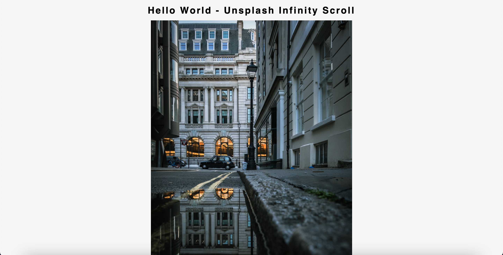

# Infinity-scroll-proj

## Purpose
A web page that displays photos using Unsplash API, and as you scroll down the page it infintely generates more photos for you to see.

## Description
Using Unsplsh.com API, we are able to display a set amount of pictures randomly for users to experience. These photos are clickable and takes you to the unsplash website where the picture is located. As you contiune to scroll down the page, more photos are randomly generated.

## Built With
* JavaScript
* HTML
* CSS

## Preview Of Page

## Deployed website
hey there